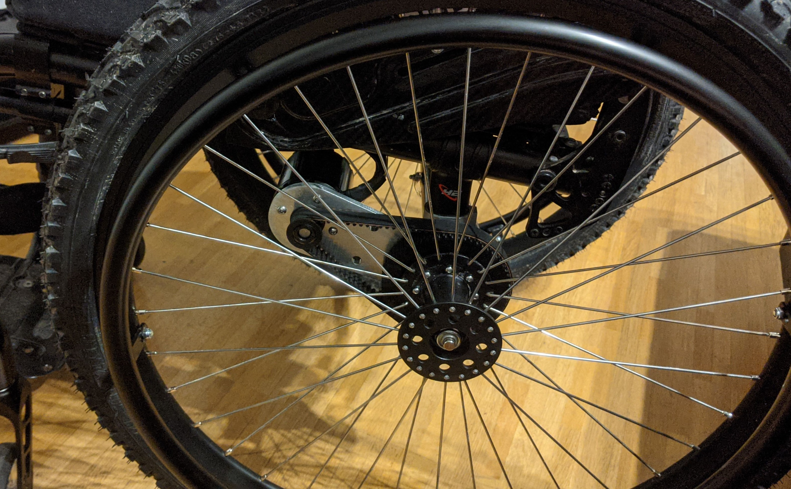

# Wheeldrive
Electric drive for wheelchairs using BLDC motors and a pulley/belt system.

## Motor
Compatible with most E-Skateboard motors with the following recommended configuration
- 6374
- 6355
- ...

## Motor Controller
[VESC Project](https://vesc-project.com)

## Mechanics
- HTD5M 15mm belt
- 15T motor pulley
- M4 screws (~20mm)
- M3 screws (~20mm)
- Bearing HK2816 (28x35x16mm)
